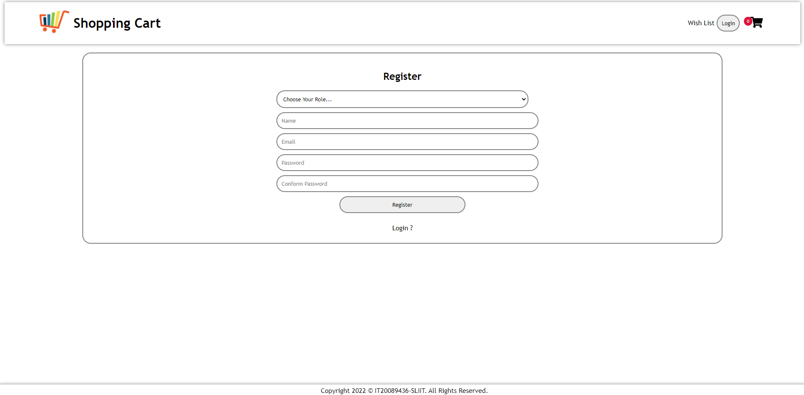
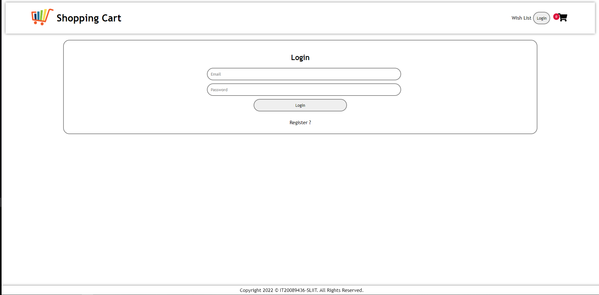
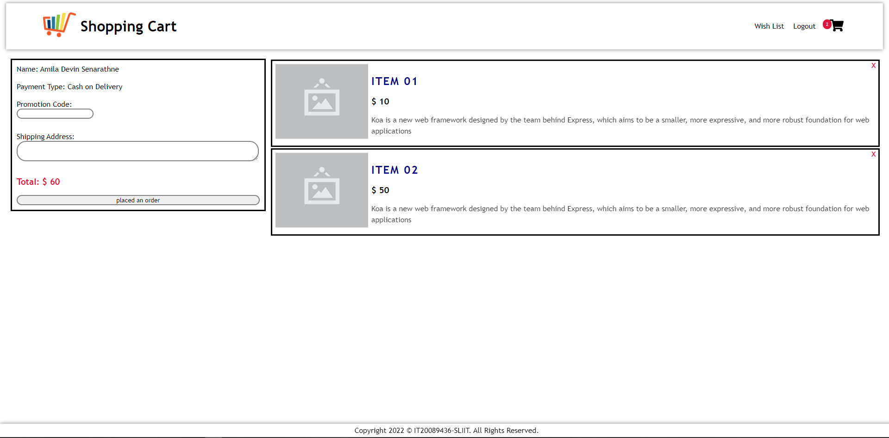
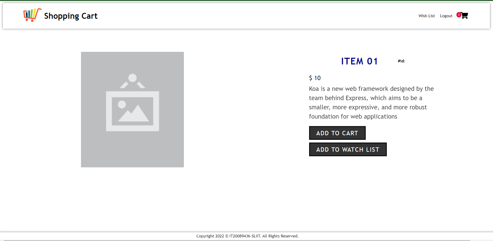
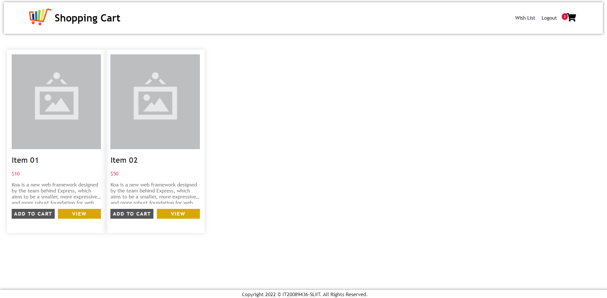
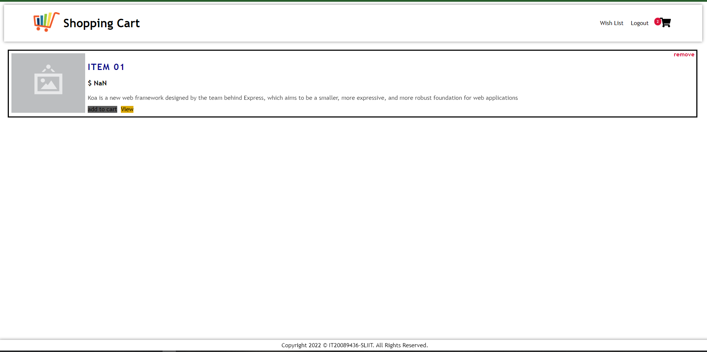
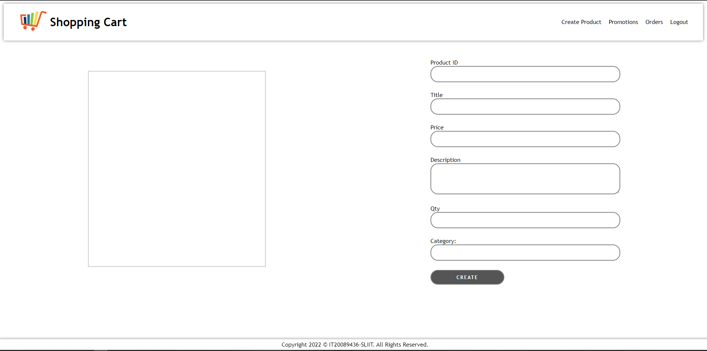
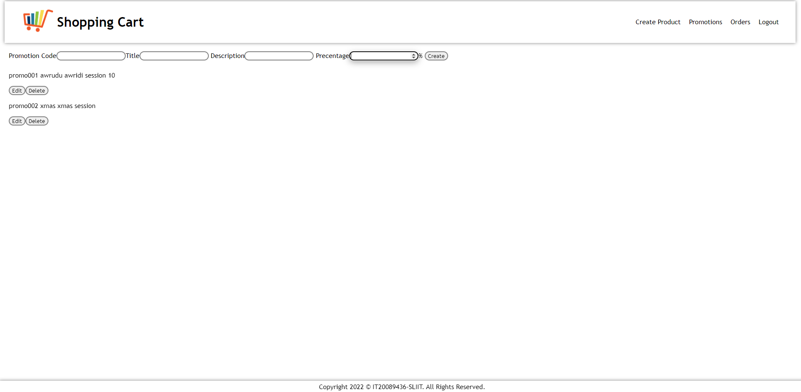
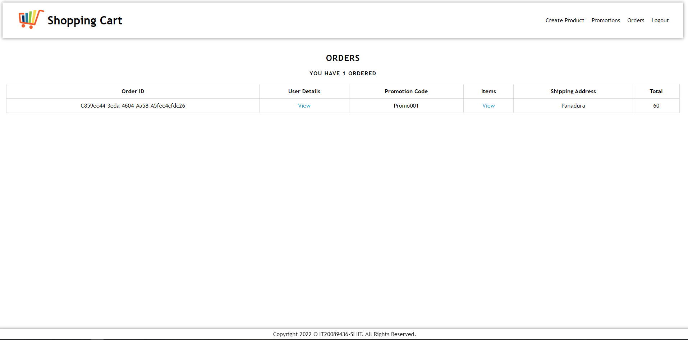
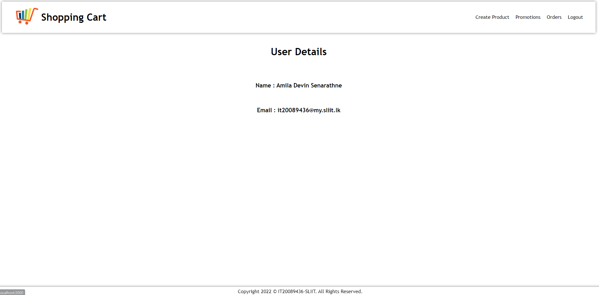

<div align="center">
   <h1>Application Frameworks - SE3040 [2021/FEB]</h1>
    <h2>Lab Assignment</h2>
    <h3>IT20089436</h3>
     <h3>Senarthne S M A D</h3>
</div>
 

<br/><br/>
    
## Installation and Run

1. Clone the repo
   ```sh
   git clone https://github.com/sliitcsse/lab-assignment-amila1998.git
   ```
3. Install NPM packages
   ```sh
     npm install
   ```
     ```sh
     cd client
     npm install
   ```
 4. To Run the Application
    ```sh
      npm run app
     ```
     
     or to run the Server only
     
      ```sh
       npm run dev
     ```
     
     and to run the client
      ```sh
       cd client
       npm start
     ```
     
     Server Running on http://localhost:5000 <br/>
     Client Runnig on http://localhost:3000
 
## Prerequisites

 * Must have an Installed [Node.js](https://nodejs.org/en/) to your local machine
    
    
## Built With

* [Reactjs](https://reactjs.org/) - React is a free and open-source front-end JavaScript library for building user interfaces based on UI components.
* [Nodejs](https://nodejs.org/en/) - Node.js is an open-source, cross-platform, back-end JavaScript runtime environment that runs on the V8 engine and executes JavaScript code outside a web browser.
* [Koajs](http://koajs.cn/)-Koa is a new web framework designed by the team behind Express, which aims to be a smaller, more expressive, and more robust foundation for web applications and APIs. By leveraging async functions, Koa allows you to ditch callbacks and greatly increase error-handling. Koa does not bundle any middleware within its core, and it provides an elegant suite of methods that make writing servers fast and enjoyable.
<br/><br/>
Other used Packages<br/><br/>
  server side:<br/>
    * bcrypt<br/>
    * bcryptjs<br/>
    * concurrently<br/>
    * koa-bodyparser<br/>
    * jsonwebtoken<br/>
    * koa-cookie-parser<br/>
    * koa-json<br/>
    * koa-router<br/>
    * koa-cors<br/><br/>

  client side:<br/>
    * axios<br/>
    * react-router-dom<br/><br/>
    
    
## SrceenShots

<h3>User</h3>
<div align="center">
  
  
  
</div>
    
<h3>Customer</h3>
<div align="center">
  
  
  
  <br/>
</div>
    
<h3>Trader</h3>
<div align="center">
  
  
  
  
  
</div>
